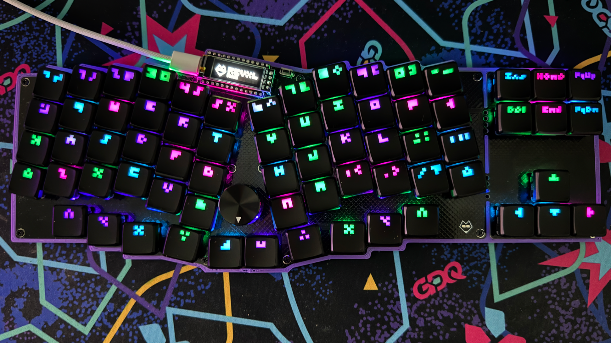
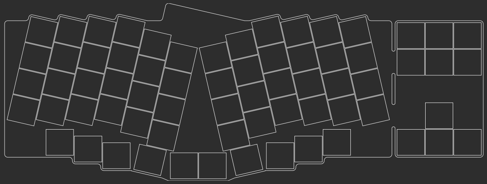
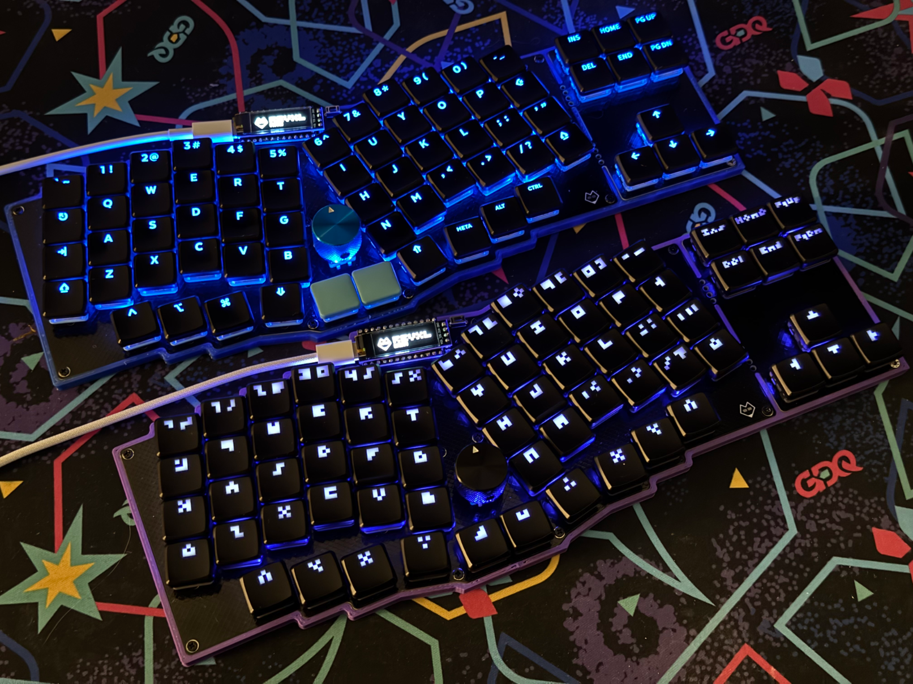

# The RevXL Keyboard

The RevXL is a maximalist Reviung-inspired ergonomic keyboard with per-key RGB LEDs, an OLED display, a rotary encoder, and a breakaway arrow cluster. It’s powered by a wired RP2040 microcontroller with QMK and Vial handling things on the firmware side. At its core, the RevXL is designed to be an on ramp to the ergonomic mechanical keyboard space. It shows off the scene’s most catchy bells and whistles while still providing a few creature comforts of more traditional layouts.

## Sponsored By PCBWay

This project is sponsored by [PCBWay](https://www.pcbway.com). They're the internet's premier PCB fabricator and are a one-stop-shop for all your prototyping needs. They offer PCB fabrication services, 3D printing with a variety of materials, and even PCBA assembly services for those of you who prefer not to solder their own projects. If it can be represented as a design file, you can probably upload it to [PCBWay](https://www.pcbway.com) and receive it a few days later in the mail.

PCBWay did a great job manufacturing the RevXL PCB. The order shipped quickly, and all of the PCBs arrived safe and sound inside of a well packed box and vacuum sealed bubbled wrap. My thanks to [PCBWay](https://www.pcbway.com) for helping to make this keyboard a reality.

## Ergogen Layout

The RevXL was designed with the Ergogen keyboard layout generator. The techniques used here are similar to those I detailed in my [Ergogen tutorial series](https://flatfootfox.com/ergogen-introduction/). The largest new additions were the considerations needed for the per-key RGB LEDs and the breakaway arrow cluster.

## Custom Keycaps

I needed to order a few additional keycaps from [FK Caps](https://fkcaps.com/?a=FlatFootFox) to fill out the arrow key cluster. I decided to use that was an excuse to create a whole custom keycap layout. It's based around a minimalist 3x3 pixel font. You can *just* make out the key glyphs if you squint.

## Build of Materials

| Part                         | Amount | Price           | Link                                                 |
| ---------------------------- | ------ | --------------- | ---------------------------------------------------- |
| Revxl PCB via PCBWay         | 1      | $60.00 USD Shipped | https://github.com/ImStuBTW/revxl                    |
| RP2040 "Pro Micro"           | 1      | $3.00 USD       | https://www.aliexpress.us/item/3256806423363289.html |
| Choc Switches                | 68     | $40.00 USD      | https://www.aliexpress.us/item/3256805697157410.html |
| 1N4148 T4 Diodes             | 68     | $2.00 USD       | https://www.aliexpress.us/item/2255800498728983.html |
| SK6812 MINI-E RGB LEDs       | 68     | $2.00 USD       | https://www.aliexpress.us/item/2255800498728983.html |
| EC11 Rotary Encoder          | 1      | $2.50 USD       | https://www.aliexpress.us/item/2255800160725313.html |
| EC11 20x15mm Knob            | 1      | $3.00 USD       | https://www.aliexpress.us/item/2251832562966356.html |
| MBK Glow Keycaps             | 1      | $55.00 USD      | https://lowprokb.ca/collections/keycaps/products/mbk-glow-r2-keycap-sets |
| 6mm x 3mm x 4.3mm Pushbutton | 1     | $2.00 USD       | https://www.aliexpress.us/item/3256801663262003.html |
| Machine Pins                 | 35     | $6.00 USD       | https://www.aliexpress.us/item/3256801663262003.html |
| Machine Pin Headers          | 39     | $4.00 USD       | https://www.aliexpress.us/item/3256801663262003.html |
| 4mm M2 Screws                | 8      | $1.00 USD       | https://www.aliexpress.us/item/2255801062616407.html |
| 2mm M2 Screw Inserts         | 8      | $1.50 USD       | https://www.aliexpress.us/item/3256804349544912.html |
| Bumpons                      | 1 Pack | $1.00 USD       | https://www.aliexpress.us/item/3256804119199524.html |

# References and Footprints

The [Reviung](https://github.com/gtips/reviung) layout concept was based after gtips' original design. The split thumb design was inspired heavily by Pete Johanson's [revxlp](https://gitlab.com/lpgalaxy/revxlp). For a similar keyboard design available in kit form without the arrow keys, please check out 42Keeb's excellent [Rev57LP](https://42keebs.eu/shop/kits/pro-micro-based/rev57lp-50-low-profile-hotswap-ergo-kit/). They've added RGB LED support in the time it took me to create this keyboard.

The breakaway arrow cluster concept was inspired by the Afternoon Labs [Breeze](https://www.afternoonlabs.com/breeze/) keyboard.

Thanks to Moonbase for the [pixel font breakdown](https://moonbench.xyz/projects/tiny-pixel-art-fonts/)! 

Cheers to Ceoloide's [Ergogen-Footprints](https://github.com/ceoloide/ergogen-footprints) repo. There's more elegant ways of including it as a local git submodule. I may have just chucked their diode, display, LED, reset switch, rotary encoder, and Choc switch footprints into my `/footprints` folder.

The RP2040 footprint was based off rroel's [KiCAD footprint](https://github.com/rroels/kicad_pro_micro_rp2040).